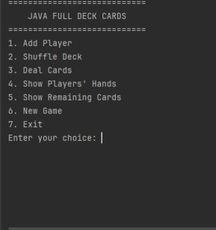
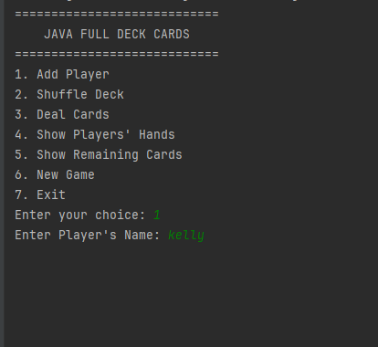
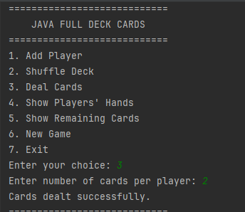
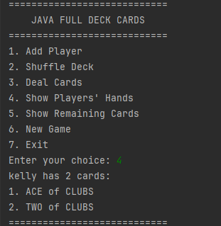
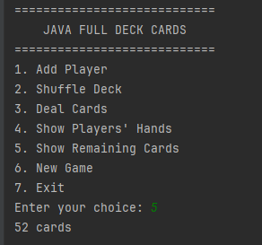

# 🃏 Java Full Deck Cards


A console-based card game application developed in Java that simulates a standard 52-card deck. The project demonstrates object-oriented programming principles, clean application design, input validation, exception handling, and game state management.

---

## Features

A console-based card game application developed in Java that simulates a standard 52-card deck. The project demonstrates object-oriented programming principles, clean application design, input validation, exception handling, and game state management.

---

## Features

- Create a standard 52-card deck automatically
- Shuffle the deck
- Add multiple players
- Deal cards evenly to players
- Display each player's hand
- Show remaining cards in the deck
- Prevent invalid game actions
- Reset the game and start over
- Robust input validation
- User-friendly console menu

---

## Technologies Used

- Java 25
- IntelliJ IDEA Community Edition
- Maven
- Git
- GitHub

---

## Project Structure

```
src
└── main
    └── java
        └── com.esegine.cards
            ├── Main.java
            ├── ConsoleUI.java
            ├── Game.java
            ├── Deck.java
            ├── Card.java
            ├── Player.java
            ├── Suit.java
            └── Rank.java
```

---

## Object-Oriented Concepts Demonstrated

- Classes and Objects
- Encapsulation
- Composition
- Enumerations
- Collections (`ArrayList`)
- Exception Handling
- Input Validation
- Separation of Concerns
- Single Responsibility Principle
- Refactoring

---

## How to Run

Clone the repository:

```bash
git clone https://github.com/kelsbaba/java-full-deck-cards.git
```

Navigate to the project:

```bash
cd java-full-deck-cards
```

Run the application from your IDE or using Maven.

---

## Menu

```
1. Add Player
2. Shuffle Deck
3. Deal Cards
4. Show Players' Hands
5. Show Remaining Cards
6. New Game
7. Exit
```

---

---

## Screenshots

### Main Menu

The application starts with a simple menu-driven interface that allows the user to perform all available game operations.


---

### Adding a Player

Adding a Player – demonstrates player creation and validation.


---

### Dealing Cards

Dealing Cards – shows the card distribution process.


---

### Showing Players' Hands

Showing Players' Hands – displays each player's dealt cards.


---

### Starting a New Game
Starting a New Game – illustrates resetting the game to its initial state.


## Sample Output

```
============================
    JAVA FULL DECK CARDS
============================

1. Add Player
2. Shuffle Deck
3. Deal Cards
4. Show Players' Hands
5. Show Remaining Cards
6. New Game
7. Exit
```

---

## Version 1.0 Highlights

- Complete 52-card deck implementation
- Console-based game engine
- Game state management
- Menu-driven interface
- Comprehensive validation
- Exception handling
- Clean code refactoring
- Fully reviewed and tested

---

## Future Improvements

Potential enhancements for Version 2.0:

- Jokers support
- Multiple card game modes
- Save and load games
- Score tracking
- Graphical User Interface (JavaFX)
- Multiplayer over a network
- Unit testing with JUnit

---

## Author

**Sunday Kelly Esegine**

GitHub: https://github.com/kelsbaba

---

### Version

Current Release: **v1.0.0**